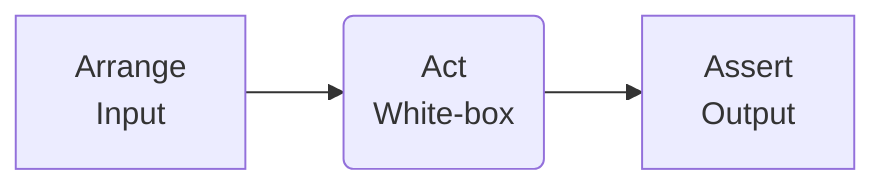

# Triple A
- Arrange
- Act
- Assert

---
# Test Coverage
- Example with `PromptBinary()`

| Testcases: | y    | Y    | n     | N     | x -> y        |
| ---------- | ---- | ---- | ----- | ----- | ------------- |
| Expected:  | true | true | false | false | retry -> true |

---
# Test Coverage

--- 
# Mockito
> Mockito er et JUnit værktøj som kan bruges til at erstatte afhængigheder, ved at stubbe afhængighederne
---
# Mockito

---
# Mockito

---
# GitHub Actions

> Continous integration (CI) pipeline, er et automatiseret system, der kan køre alle Unit Tests før du merger kode ind i `main` branchen

---
# GitHub Actions

